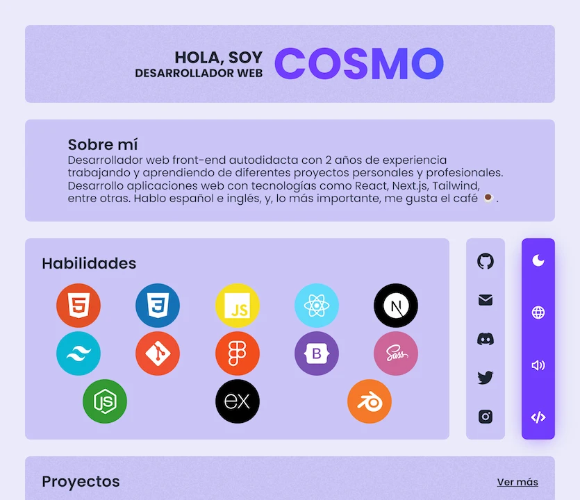

<!-- PROJECT LOGO -->

	
 
 

# Cosmo - Portafolio

My portafolio, made with React, CSS y JS. Design made by me in figma.

  <a href="https://cosmoart.vercel.app">View Demo</a>
  ·
  <a href="https://github.com/cosmoart/Portafolio/issues">Report Bug</a>
  ·
  <a href="https://github.com/cosmoart/portafolio/issues">Send suggestion</a>

<!-- TABLE OF CONTENTS -->

Table of contents

- [About The Project](#about-the-project)
- [Screenshots](#screenshots)
- [Built With](#built-with)
- [License](#license)
- [Contact](#contact)

<!-- ABOUT THE PROJECT -->
## About The Project

This is my portfolio, I made it with React, CSS and JS. I wanted to make it as pure as possible, without using any library or framework. I also made the design in Figma, inspired by many other incredible portfolios.

<!-- SCREENSHOTS -->
## Screenshots

<table>
    <tr>
      <td>
          
      </td>
      <td>
          
      </td>
      <td>
          
      </td>
    </tr>
    <tr>
      <td>
          
      </td>
      <td>
          
      </td>
      <td>
          
      </td>
    </tr>
</table>

### Built With

* [Vite](https://vitejs.dev/)
* [React.js](https://reactjs.org/)

<!-- LICENSE -->
## License

Distributed under the MIT License. See [`LICENSE`](https://github.com/cosmoart/portafolio/blob/main/LICENCE) for more information.

<!-- CONTACT -->
## Contact

-   My website - [cosmoart.vercel.app](https://cosmoart.vercel.app)
-   Twitter - [@CosmoArt0](https://twitter.com/cosmoart0)
-   Instagram - [@cosmo_art0](https://www.instagram.com/cosmo_art0/)

<a href="#top">⬆️ Back to top</a>

